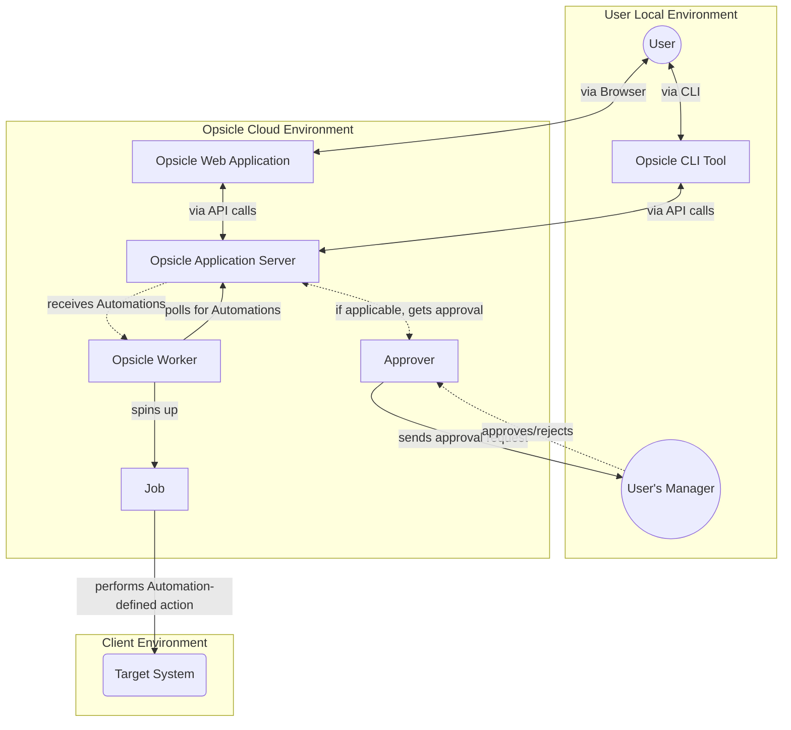
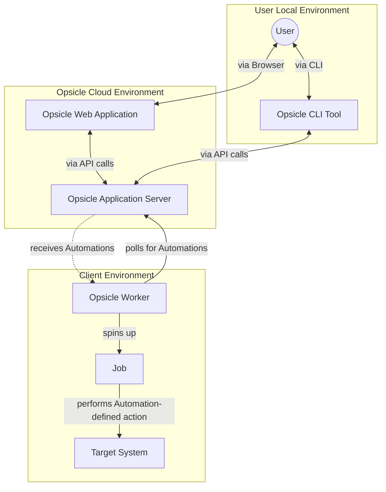
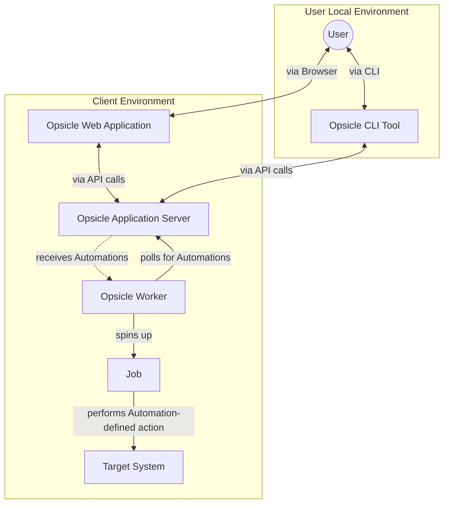

# Opsicle Architecture

This page documents the architecture of Opsicle at various levels

## Request Flows

### Fully managed model

### Shared responsibilities model

This is what the components would look like if you were to subscribe to a cloud plan but want your 

### Self-hosted model

This is what the components would look like if you were to host Opiscle entirely yourself.

