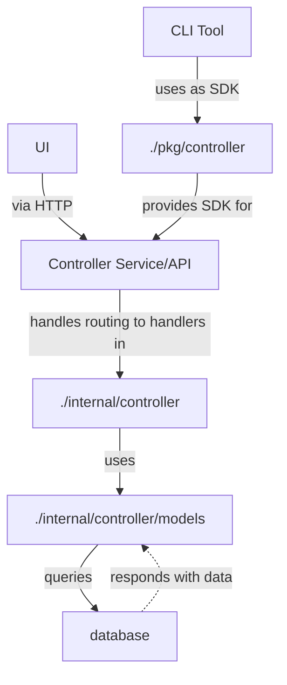
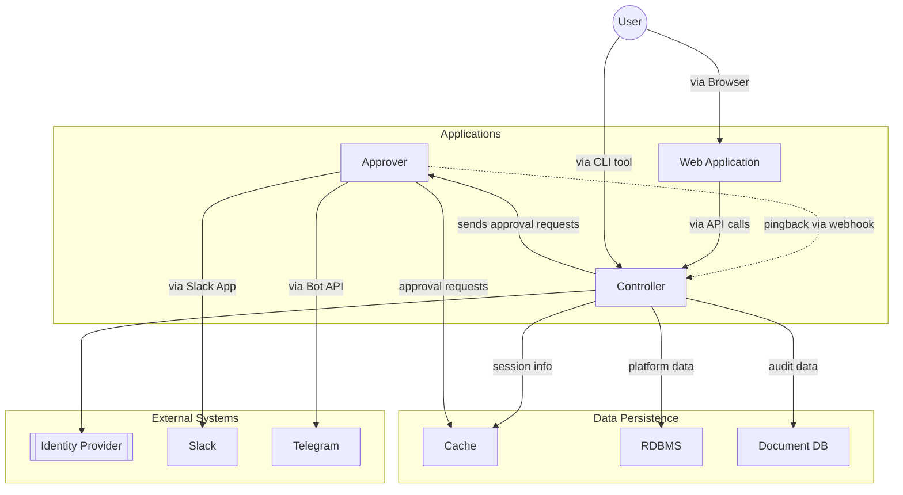
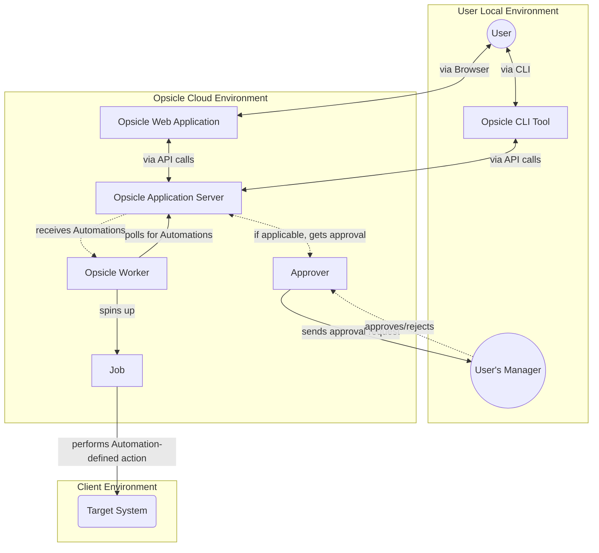
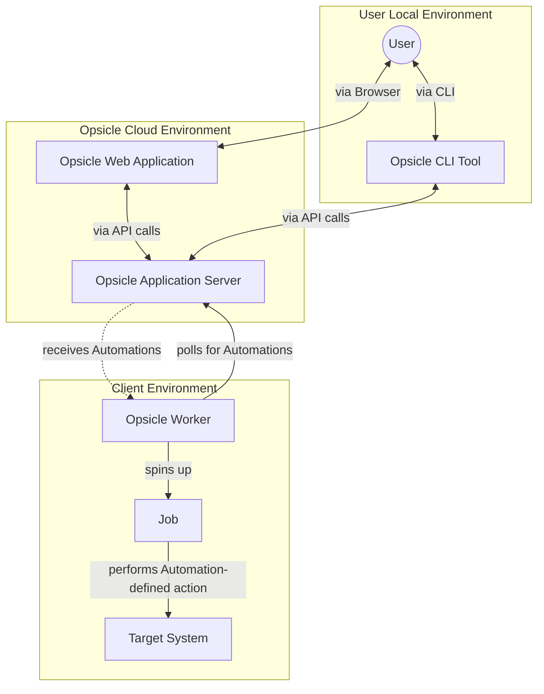
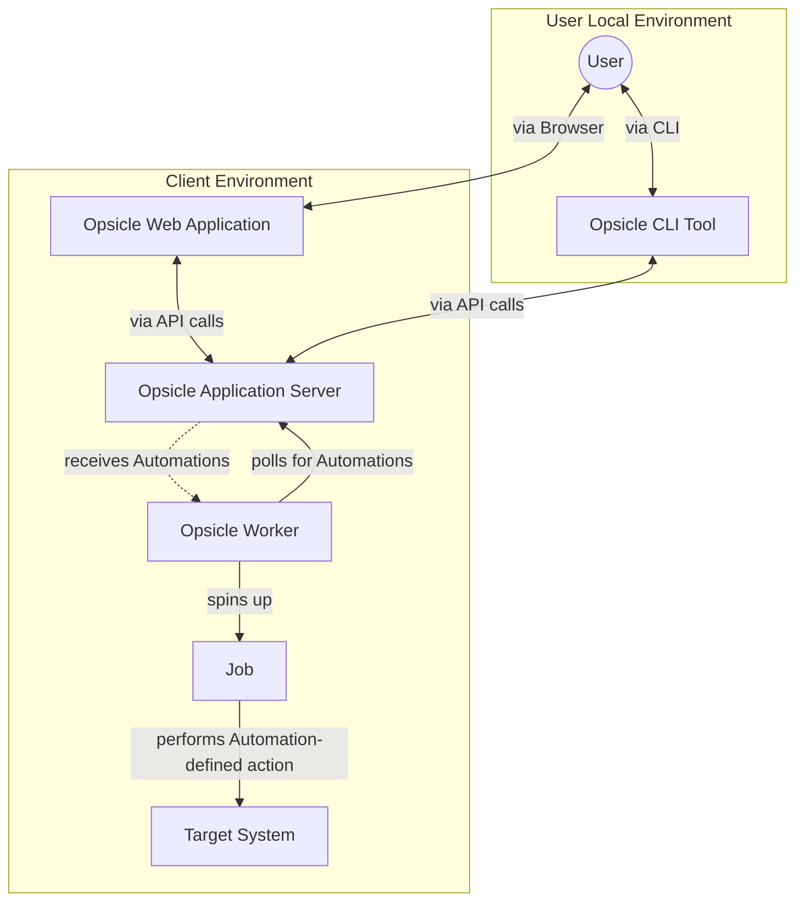

# System Architecture

This page documents the architecture of Opsicle at various levels

Opsicle consists of four main components:

1. CLI tool (`opsicle`) with the code root found at `./cmd/opsicle`
2. Controller (`controller`) which is started via the CLI tool with the code root found at `./cmd/opsicle/start/controller`
2. Coordinator (`coordinator`) which is started via the CLI tool with the code root found at `./cmd/opsicle/start/coordinator`
2. Worker (`worker`) which is started via the CLI tool with the code root found at `./cmd/opsicle/start/worker`

## Components

### CLI tool

- Primary user interface for the Opsicle system

### Controller

- Provides an API for the management console
- 

### Coordinator

- Provides an API for workers to connect to

### Worker

- Runs in a client's production environment

### Data stores

#### MongoDB

MongoDB is used as the audit database and used to store audit logs for all user and system actions.

1. [MongoDB Compass](https://www.mongodb.com/products/tools/compass) is the recommended tool for working with MongoDB. Download it from [this link](https://www.mongodb.com/try/download/compass)
2. To update the username/password locally, you need to remove the entire data directory and start MongoDB from scratch

#### MySQL

MySQL is used as the platform database and used to persist system data.

1. [MySQL Workbench](https://www.mysql.com/products/workbench/) is the recommended tool for working with MySQL. Download it from [this link](https://dev.mysql.com/downloads/workbench/)

#### NATS

NATS is used as the queue system for submitting automations and processing them.

1. [NATS UI](https://natsnui.app/) (included in the `docker-compose` setup) is the recommended tool for working with NATS. After spinning up Docker Compose, you can access it at [http://localhost:31311](http://localhost:31311)

#### Redis

Redis is used as a cache for all internal systems (ie. `controller` and `coordinator`)

1. [Redis Insight](https://redis.io/insight/) (included in the `docker-compose` setup) is the recommended tool for working with Redis. After spinning up Docker Compose, you can access it at [http://localhost:5540](http://localhost:5540)
2. To generate the password seen in the `redis.conf` file, use `printf -- '${THE_PASSWORD_YOU_WANT} | sha256sum -'

## Packages

> Last updated 2025-08-16

## Deployment

> Last updated 2025-08-05

## Request Flows

### Fully managed model

### Shared responsibilities model

This is what the components would look like if you were to subscribe to a cloud plan but want your 

### Self-hosted model

This is what the components would look like if you were to host Opiscle entirely yourself.

